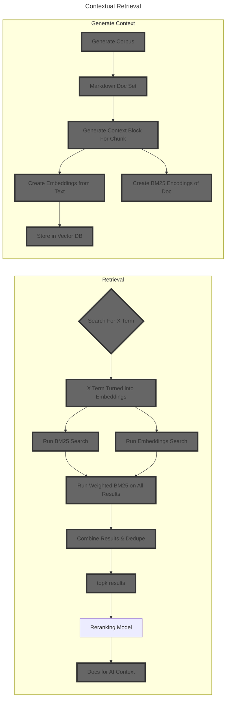

# A Pattern Language - Contextual Retrieval Experiment (October 10, 2024)

Let's implement Anthropic's new [Contextual Retrival technique](https://www.anthropic.com/news/contextual-retrieval) using A Pattern Language by Christopher Alexander as the source corpus.

## Decisions
Q: How to define chunks
A: We'll do a chunk per chapter (per "word" in the language)

## What are the ways we could chunk documents?

- Brute Force
  - Split on every X character
- Smart Brute Force
  - Rules based split
    - Split on every X character, but only after a period
  - tokenizer you could use that then lets you split intelligently
- -> Document Structure Split
  - Every X pages
  - Everytime I see an H1
- -> Semantic Split
  - Something about the document has meaning that makes you want to split on it

My attempt is to use split on H1 (# symbol)
- This should indicate a new chapter
- Since I want each chunk to be a "word" from A Pattern Language, and each word is a chapter, this would also carry some semantic meaning
